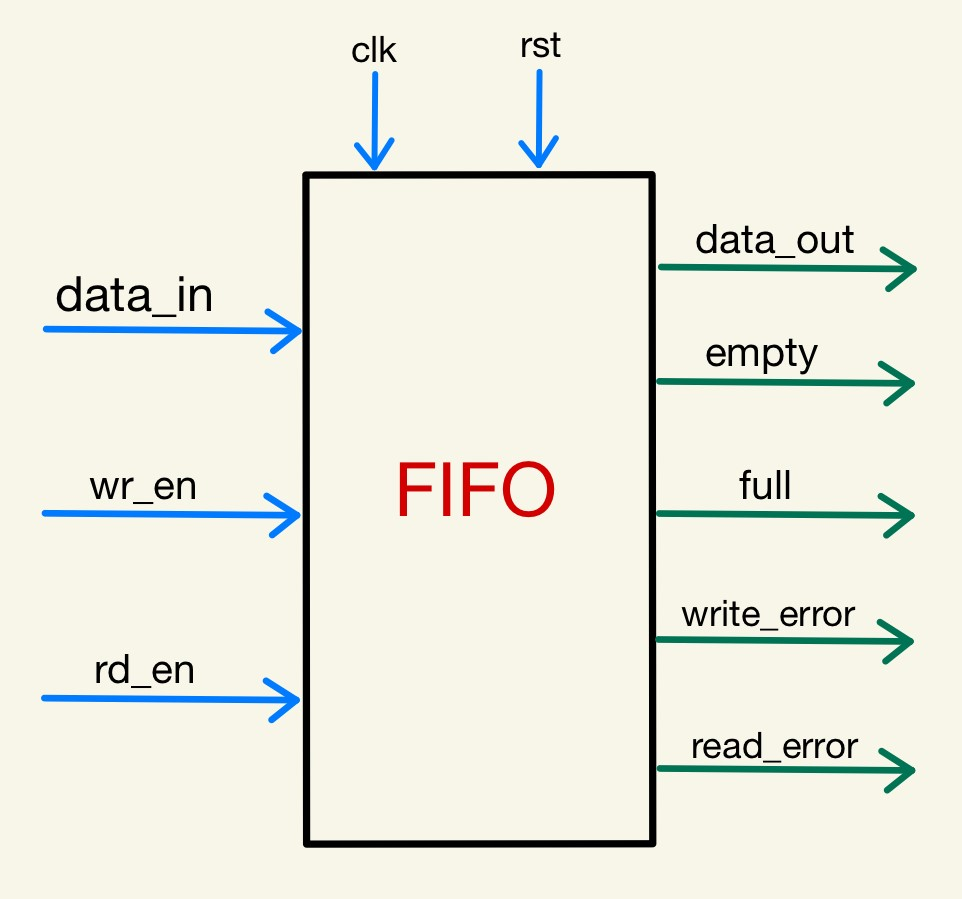

# FIFO Testbench Development using UVM 
### Description
This repository contains a Verilog implementation of a Synchronous FIFO (First-In-First-Out) design, along with a UVM (Universal Verification Methodology) testbench for comprehensive verification. The FIFO design provides a reliable data storage mechanism with synchronous read and write operations, while the UVM testbench ensures the functional correctness and performance of the design.

EDA Playground link : [FIFO_UVM_TB](https://www.edaplayground.com/x/X92F) 

## Synchronous FIFO Design and UVM Testbench

  

 <em>FIFO Block Diagram </em>

  
### Features

- Synchronous FIFO Design: A robust synchronous FIFO design is implemented in Verilog, offering efficient data storage and retrieval capabilities.
- UVM Testbench: A comprehensive UVM testbench is developed to thoroughly verify the FIFO design under various scenarios.
- Simulation Environment: The testbench is designed to work with popular simulators, enabling easy integration into different simulation environments.
  
### Design Simulation Output:
  
  
 <em>Simulation Waveforms </em>

  
### Prerequisites

- Verilog Simulator (e.g., ModelSim, VCS, Questa)
- UVM Framework 

### Directory Specifications:

- [Common](Common) : This directory houses essential files that are shared and utilized across the entire testbench.
- [Design](Design) : Contains the Verilog file for FIFO implementation
- [Testbench](Testbench) : Within the testbench directory, you'll find a collection of UVM test files, each serving a specific purpose in thoroughly testing the FIFO implementation.
- [Images](Images) : Contains the images used in this readme file.
  
*Feel free to explore these directories to gain insights into the project's architecture and components.*

TODO: Update readme

 

 
